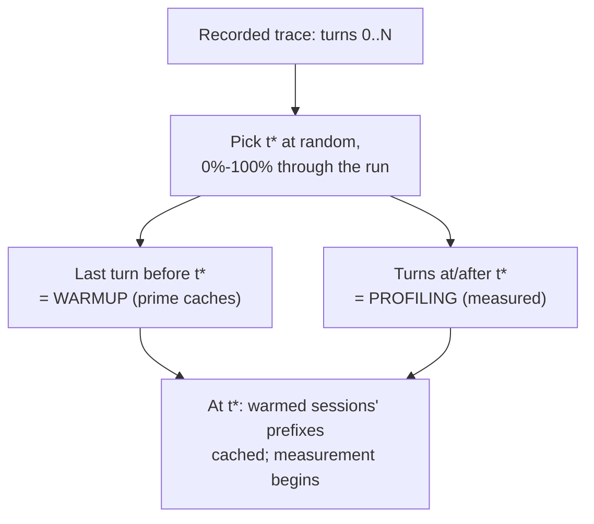
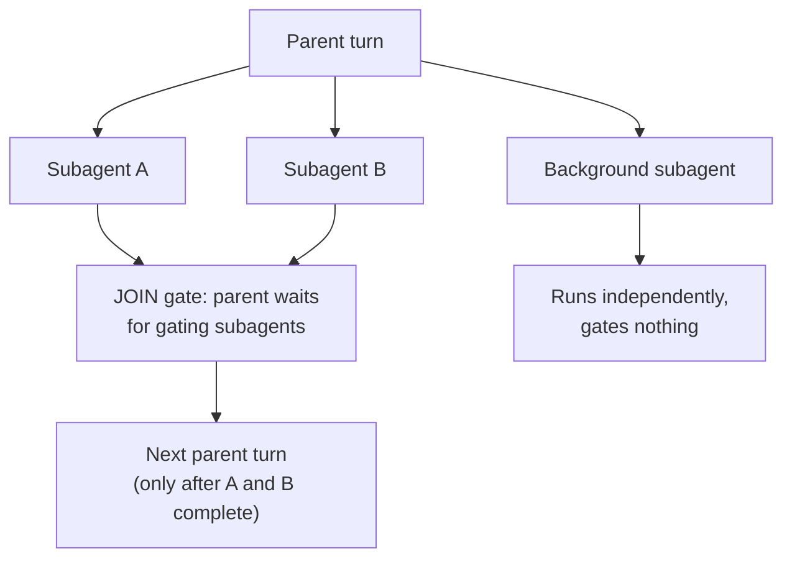
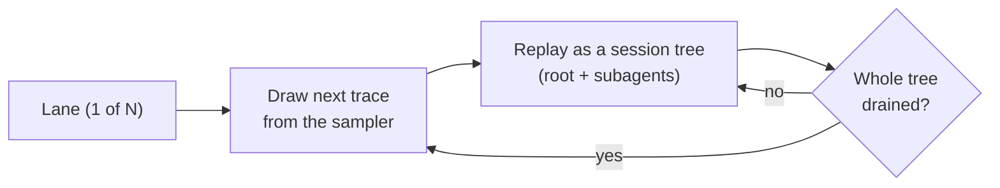
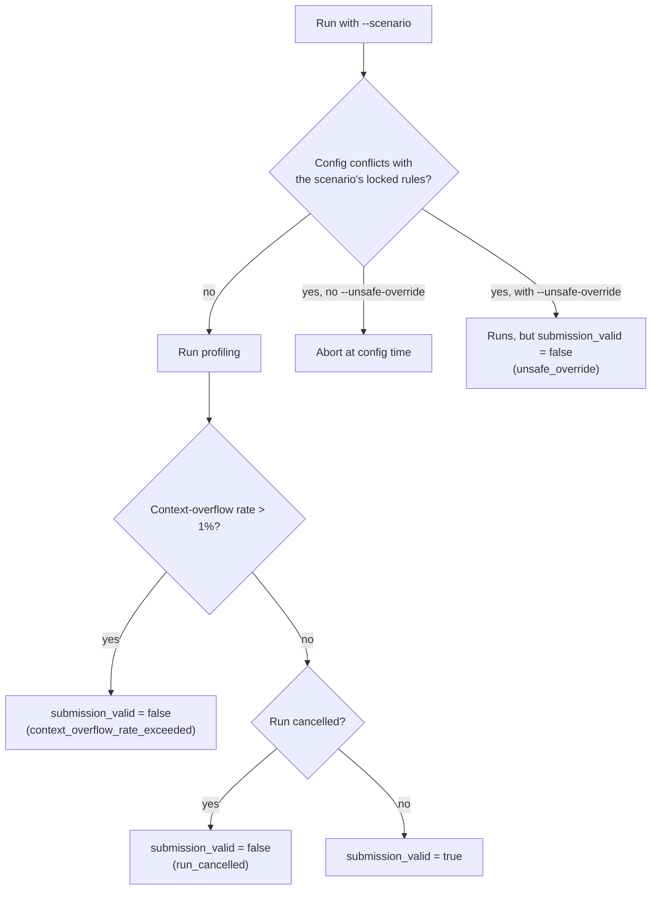
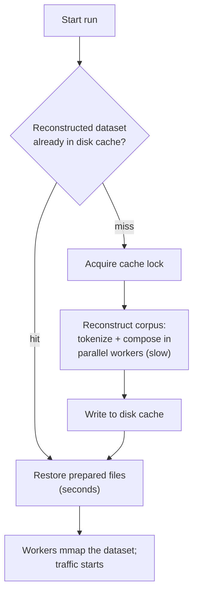

# Understanding the SemiAnalysis AgentX Benchmark

A guide for **LLM-serving optimization engineers** who want to understand what the SemiAnalysis
AgentX benchmark actually does to an inference server, what it measures, and how to configure and
interpret it.

SemiAnalysis AgentX works differently from conventional load tests: it does not fire uniform synthetic
prompts at a fixed request rate. Instead it **replays the real shape of agentic-coding traffic** —
captured multi-turn traces from coding agents that spawn subagents, reuse large context prefixes, and
call tools — while faithfully reproducing the **KV-cache block structure** of that traffic. Be precise
about what "real" means here: the traffic *shape* is real (prompt sizes, prefix-sharing, subagent
fan-out, inter-turn timing), but the prompt *content* is synthetically generated — token-count-exact,
cache-structure-exact filler, because the original coding text is anonymized away in the capture (see
[§3](#3-how-realistic-are-the-prompts-and-token-counts)). If you are tuning prefix caching,
prefill/decode balance, scheduling, or memory under agentic workloads, this is the load generator
designed to stress those exact behaviors.

The datasets are hosted on HuggingFace and stored in a JSON capture format called *Weka*. You won't
author or edit Weka files by hand — AIPerf consumes them directly — so the interesting part for this
guide is the SemiAnalysis AgentX workload they carry. For the format details, see the
[Weka trace tutorial](../tutorials/weka-trace.md).

The FAQ is organized around the questions a serving engineer actually asks. If you just want a
copy-pasteable how-to, start with the [AgentX MVP tutorial](../tutorials/agentx-mvp.md) and come back
here for the mechanics.

---

## Quickstart

Point AIPerf at your running server and go — replace `YOUR_MODEL` with the model your server serves;
every other flag is either scenario-locked, a scenario default, or your load dial (see the legend):

```bash
aiperf profile \
  --scenario inferencex-agentx-mvp \
  --url http://localhost:8000 \
  --model YOUR_MODEL \
  --endpoint-type chat \
  --public-dataset semianalysis_cc_traces_weka_062126 \
  --concurrency 256 \
  --benchmark-duration 1800 \
  --streaming \
  --system-idle-gap-cap-seconds 10.0 \
  --trajectory-start-min-ratio 0.0 \
  --trajectory-start-max-ratio 1.0 \
  --cache-bust first_turn_prefix \
  --use-server-token-count \
  --artifact-dir ./artifacts/my-run/
```

**Flag legend.** The command spells out the `inferencex-agentx-mvp` locks so you can see exactly what
runs. Apart from `--public-dataset` — which you must supply yourself (the scenario validates it
against its Weka allowlist but never fills one in) — you could drop every scenario-locked/default
flag and get the same behavior (the scenario auto-fills them); they are written out here for
transparency.

- **Scenario-locked** (a conflicting value is rejected): `--streaming`,
  `--system-idle-gap-cap-seconds 10.0`, `--cache-bust first_turn_prefix`, and a pinned `--public-dataset`.
  `--streaming` auto-enables if you omit it.
- **Always on, no flag:** replay delays are always end-to-start (see below); there is no toggle.
- **Scenario defaults** (auto-filled if omitted; you may override): `--benchmark-duration 1800` (floor
  900s), `--trajectory-start-min-ratio 0.0` / `--trajectory-start-max-ratio 1.0` (sample t\* across the
  full run).
- **Auto-injected, no flag:** `ignore_eos=true` is added to `--extra-inputs` (passing `ignore_eos=false`
  is rejected), and a fresh `--random-seed` is filled in — pin one yourself for reproducible run-to-run
  comparisons ([§7](#7-reading-the-results-metrics-validity-and-submission-requirements)). Timing mode is
  locked to agentic-replay.
- **Optional timing control:** `--trace-idle-gap-cap-seconds` limits observed
  whole-tree idle time independently for each root and all of its descendants.
- **Forbidden — do not pass:** `--ignore-trace-delays`,
  `--inter-turn-delay-cap-seconds`, `--synthesis-max-isl` (input truncation), and the
  rate/schedule flags `--request-rate` / `--arrival-pattern` / `--user-centric-rate` / `--fixed-schedule`
  / `--adaptive-scale`.
- **Your parameters** (not locked): `--url`, `--model`, `--endpoint-type chat`, `--concurrency`,
  `--use-server-token-count`, `--artifact-dir`.
- **Sizing to your server** (optional, not scenario-checked): add
  `--max-context-length <your server's context window>` to drop traces whose peak prompt+output
  wouldn't fit (then keep the first N eligible when `--num-dataset-entries` is set); a ~256k-window
  server should instead pick a `_256k` corpus
  ([§3](#3-how-realistic-are-the-prompts-and-token-counts)). When concurrency exceeds the loaded
  pool, wrapping happens automatically because the scenario locks
  `--cache-bust first_turn_prefix` on (an active cache-bust marker keeps repeated traces distinct);
  without cache-bust you would need `--allow-dataset-wrap` or a lower concurrency.

The [AgentX MVP tutorial](../tutorials/agentx-mvp.md#quick-start)'s Quick Start is the same run,
written slightly differently: it uses the rolling `semianalysis_cc_traces_weka_with_subagents` alias
(this page pins the `062126` drop it currently resolves to) and writes out `--max-context-length`, a
pinned `--random-seed`, and `--ui simple`.

What to expect:

- **What this does to your server:** holds 256 concurrent agent sessions (trajectory trees) for the
  benchmark duration (1800s here), replaying the real *shape* of coding-agent traffic — large reused
  prefixes, varied decode lengths, and subagent fan-out (with synthetic filler content) — rather than
  synthetic uniform load.
- **The first run is slow on purpose:** before any traffic, AIPerf reconstructs the corpus into a
  tokenized, cache-structured dataset. That is a one-time, cached cost — see
  [§8](#8-running-the-benchmark-and-why-the-first-run-is-slow).
- **Then check `submission_valid`** in `./artifacts/my-run/profile_export_aiperf.json` to confirm the run
  respected the scenario's locked rules — see
  [§7](#7-reading-the-results-metrics-validity-and-submission-requirements).

**If it breaks:**

- Configuration times out before any traffic starts → raise the reconstruction timeouts
  ([§8 troubleshooting](#q-configuration-times-out-before-any-traffic-starts)).
- Connection resets (`ECONNRESET`) partway through → lower the client keep-alive
  ([§8 troubleshooting](#q-my-run-dies-partway-with-connection-resets)).
- `submission_valid: false` → find which locked rule or health bound tripped
  ([§7](#7-reading-the-results-metrics-validity-and-submission-requirements)).

---

## Table of contents

- [Quickstart](#quickstart)
1. [What is this benchmark and what is it measuring?](#1-what-is-this-benchmark-and-what-is-it-measuring)
    - [In one sentence, what is SemiAnalysis AgentX?](#q-in-one-sentence-what-is-semianalysis-agentx)
    - [Where does the traffic come from?](#q-where-does-the-traffic-come-from)
    - [What is it actually trying to measure that a normal load test can't?](#q-what-is-it-actually-trying-to-measure-that-a-normal-load-test-cant)
2. [What load does it actually put on my server?](#2-what-load-does-it-actually-put-on-my-server)
    - [How is the load shaped over time?](#q-how-is-the-load-shaped-over-time)
    - [What does `--concurrency N` mean for this benchmark?](#q-what-does---concurrency-n-mean-for-this-benchmark)
    - [Are inter-turn delays honored, or is it as-fast-as-possible?](#q-are-inter-turn-delays-honored-or-is-it-as-fast-as-possible)
    - [What does a single session look like on the wire?](#q-what-does-a-single-session-look-like-on-the-wire)
3. [How realistic are the prompts and token counts?](#3-how-realistic-are-the-prompts-and-token-counts)
    - [Are the prompts real text, or synthesized?](#q-are-the-prompts-real-text-or-synthesized)
    - [How exact is the input sequence length (ISL)?](#q-how-exact-is-the-input-sequence-length-isl)
    - [How is the output sequence length (OSL) controlled?](#q-how-is-the-output-sequence-length-osl-controlled)
    - [How does it reproduce KV-cache prefix sharing specifically?](#q-how-does-it-reproduce-kv-cache-prefix-sharing-specifically)
    - [What does a recorded trace actually look like?](#q-what-does-a-recorded-trace-actually-look-like)
    - [Show me how those turns become what's actually sent on the wire.](#q-show-me-how-those-turns-become-whats-actually-sent-on-the-wire)
    - [The traces were recorded against Claude models — and one trace can mix two of them. I serve one model; what is actually sent?](#q-the-traces-were-recorded-against-claude-models--and-one-trace-can-mix-two-of-them-i-serve-one-model-what-is-actually-sent)
    - [Is there a way to know the "ideal" cache-hit rate for a run?](#q-is-there-a-way-to-know-the-ideal-cache-hit-rate-for-a-run)
    - [What about tool calls — do they hit my server as real tool schemas?](#q-what-about-tool-calls--do-they-hit-my-server-as-real-tool-schemas)
    - [Several corpora have a `_256k` variant — which should I use?](#q-several-corpora-have-a-_256k-variant--which-should-i-use)
    - [How does `_256k` differ from just passing `--max-context-length`?](#q-how-does-_256k-differ-from-just-passing---max-context-length)
4. [The KV-cache story: warmup, t\*, and cache-busting](#4-the-kv-cache-story-warmup-t-and-cache-busting)
    - [Why start each session at a sampled point t\* rather than always from turn 0?](#q-why-start-each-session-at-a-sampled-point-t-rather-than-always-from-turn-0)
    - [What exactly does the warmup phase send?](#q-what-exactly-does-the-warmup-phase-send)
    - [What is cache-busting and why would I want it?](#q-what-is-cache-busting-and-why-would-i-want-it)
    - [How is the marker designed so it doesn't break the warmup-to-profiling cache handoff?](#q-how-is-the-marker-designed-so-it-doesnt-break-the-warmup-to-profiling-cache-handoff)
    - [Where is the marker placed in the prompt?](#q-where-is-the-marker-placed-in-the-prompt)
    - [Does cache-busting change my reconstructed dataset / cache key?](#q-does-cache-busting-change-my-reconstructed-dataset--cache-key)
5. [Subagents, forks, and joins: the agentic shape of the load](#5-subagents-forks-and-joins-the-agentic-shape-of-the-load)
    - [How are subagents represented in the load?](#q-how-are-subagents-represented-in-the-load)
    - [Do subagents run in parallel or in sequence?](#q-do-subagents-run-in-parallel-or-in-sequence)
    - [How is the classification of "real subagent" vs "small helper call" decided?](#q-how-is-the-classification-of-real-subagent-vs-small-helper-call-decided)
    - [Do subagents consume my `--concurrency` budget?](#q-do-subagents-consume-my---concurrency-budget)
    - [What if a subagent errors out?](#q-what-if-a-subagent-errors-out)
6. [Concurrency, lanes, and steady state](#6-concurrency-lanes-and-steady-state)
    - [How does the benchmark keep N sessions alive throughout the run?](#q-how-does-the-benchmark-keep-n-sessions-alive-throughout-the-run)
    - [What decides which trace a lane runs next?](#q-what-decides-which-trace-a-lane-runs-next)
    - [Does the run length depend on the dataset size?](#q-does-the-run-length-depend-on-the-dataset-size)
    - [How do I scale the offered load up or down?](#q-how-do-i-scale-the-offered-load-up-or-down)
    - [Can I sweep concurrency (e.g. `--concurrency 64,128,256`) in one invocation?](#q-can-i-sweep-concurrency-eg---concurrency-64128256-in-one-invocation)
7. [Reading the results: metrics, validity, and submission requirements](#7-reading-the-results-metrics-validity-and-submission-requirements)
    - [What performance numbers does the benchmark report?](#q-what-performance-numbers-does-the-benchmark-report)
    - [Are latencies measured per request or per session?](#q-are-latencies-measured-per-request-or-per-session)
    - [How do I compare two runs (or two servers) fairly?](#q-how-do-i-compare-two-runs-or-two-servers-fairly)
    - [What is `submission_valid` and where do I see it?](#q-what-is-submission_valid-and-where-do-i-see-it)
    - [What can make a run invalid?](#q-what-can-make-a-run-invalid)
    - [What counts as a "context overflow," and why does it gate validity?](#q-what-counts-as-a-context-overflow-and-why-does-it-gate-validity)
    - [If my server overflows occasionally, does the whole run get thrown out?](#q-if-my-server-overflows-occasionally-does-the-whole-run-get-thrown-out)
    - [Do generic request errors (HTTP 500s, timeouts) invalidate the run?](#q-do-generic-request-errors-http-500s-timeouts-invalidate-the-run)
    - [My server has a ~256k context window and the run keeps overflowing — what's the right fix?](#q-my-server-has-a-256k-context-window-and-the-run-keeps-overflowing--whats-the-right-fix)
    - [How do I visualize what actually happened during the run?](#q-how-do-i-visualize-what-actually-happened-during-the-run)
    - [How do I inspect the exact prompts/messages a run sent?](#q-how-do-i-inspect-the-exact-promptsmessages-a-run-sent)
8. [Running the benchmark (and why the first run is slow)](#8-running-the-benchmark-and-why-the-first-run-is-slow)
    - [Why does the first run take minutes to "configure" before any traffic?](#q-why-does-the-first-run-take-minutes-to-configure-before-any-traffic)
    - [Is that cost paid on every run?](#q-is-that-cost-paid-on-every-run)
    - [What invalidates that cache?](#q-what-invalidates-that-cache)
    - [How is the prepared dataset shared with the worker processes?](#q-how-is-the-prepared-dataset-shared-with-the-worker-processes)
    - [How do I know AIPerf itself isn't the bottleneck at high concurrency?](#q-how-do-i-know-aiperf-itself-isnt-the-bottleneck-at-high-concurrency)
    - [Which endpoint does it hit, and why streaming?](#q-which-endpoint-does-it-hit-and-why-streaming)
    - [What's the minimal way to run it?](#q-whats-the-minimal-way-to-run-it)
    - [Can I do a short smoke test before committing to the full 30 minutes?](#q-can-i-do-a-short-smoke-test-before-committing-to-the-full-30-minutes)
    - [Troubleshooting common failures](#troubleshooting-common-failures)
        - [Configuration times out before any traffic starts](#q-configuration-times-out-before-any-traffic-starts)
        - [My run dies partway with connection resets](#q-my-run-dies-partway-with-connection-resets)
9. [Multi-replica serving: conversation-aware routing (SGLang, Dynamo)](#9-multi-replica-serving-conversation-aware-routing-sglang-dynamo)
    - [I'm serving multiple replicas behind a router — how do I make routing conversation-aware?](#q-im-serving-multiple-replicas-behind-a-router--how-do-i-make-routing-conversation-aware)
    - [Client-side routing flags (reference)](#client-side-routing-flags-reference)
10. [Configuration knobs that matter](#10-configuration-knobs-that-matter)
    - [Load and duration](#load-and-duration)
    - [Fidelity / shape](#fidelity--shape)
    - [Validity thresholds (environment variables)](#validity-thresholds-environment-variables)
    - [Operational (environment variables)](#operational-environment-variables)
    - [Subagent-classification tuning (advanced)](#subagent-classification-tuning-advanced)
11. [Practical caveats and things that surprise people](#11-practical-caveats-and-things-that-surprise-people)

---

## 1. What is this benchmark and what is it measuring?

### Q: In one sentence, what is SemiAnalysis AgentX?
It replays recorded multi-turn agentic-coding traces against your server, reproducing the real
prompt sizes, KV-cache prefix-sharing structure, subagent fan-out, and inter-turn timing of that
traffic — so the throughput and latency numbers you get reflect how your server behaves under
realistic agentic load rather than synthetic uniform load. You select it with
`--scenario inferencex-agentx-mvp`.

### Q: Where does the traffic come from?
From SemiAnalysis captures of real coding-agent sessions (the "cc-traces" corpora). Each recorded
**trace** is one real agent run: an ordered stream of API calls with their token counts, cache-block
identities, tool-use markers, timestamps, and any subagents it spawned. The benchmark ships
several dated corpora (for example the current-default `062126` corpus with ~393 traces; older date
pins like `061526` remain accepted for reproducibility). You select one with
`--public-dataset`. The AgentX scenario stamps `submission_valid: true` only for
pinned SemiAnalysis `*_weka_*` public corpora and `weka_hf` pinned to the
`semianalysisai/cc-traces-weka-062126` HuggingFace repo. Local `weka_trace`
directories (`--custom-dataset-type weka_trace`) are format-compatible for
offline smoke tests but require `--unsafe-override` under the scenario
(`submission_valid: false`) — AIPerf cannot fingerprint an arbitrary local
dir as the public corpus. Under the scenario, `weka_hf` rejects any
other `--hf-weka-dataset` value; outside the scenario lock, `weka_hf` accepts any compatible Weka
dataset.

**Terminology used throughout this guide.** A **trace** is one recorded agent run as it sits in the
corpus — corpora are counted in traces, the sampler picks traces, and load-time filters drop traces.
A **session** is one *live replay* of a trace during the benchmark. The same trace can be replayed as
multiple sessions — on several lanes at once, or again later as lanes recycle — and each replay is a
distinct session (which is exactly why cache-busting exists; see [§4](#4-the-kv-cache-story-warmup-t-and-cache-busting)).
A **trajectory** is a session's planned replay path through its trace — the sampled t\* plus the turns
at and after it — and a **trajectory tree** is the whole session tree (a root plus its subagents).

### Q: What is it actually trying to measure that a normal load test can't?
Three things a uniform-random-prompt benchmark cannot reproduce:

- **Realistic prefix-cache behavior.** Agentic coding has enormous prompt prefixes that are reused
  turn-over-turn and shared across a session's subagents. The benchmark reconstructs prompts so that
  the *block-level* cache-reuse pattern matches the original traffic. Your server's prefix-cache hit
  rate under this load is representative, not artificial.
- **Realistic prefill/decode mix.** Inputs are large (long agentic context) and outputs vary; the
  benchmark hits the recorded input and output token counts, so your prefill-vs-decode pressure
  matches reality.
- **Realistic concurrency shape.** Sessions are multi-turn and spawn subagents that run in parallel
  or in sequence with join points. This produces bursty, tree-structured concurrency rather than a
  flat stream of independent requests.

---

## 2. What load does it actually put on my server?

### Q: How is the load shaped over time?
Each lane's **initial** session is replayed starting from a random wall-clock instant **t\*** sampled
uniformly across the **full** recorded run (0%–100%) under the AgentX scenario (the generic
agentic-replay default outside the scenario is 25%–75%). For each session mid-flight at t\*, the
**single turn immediately before t\*** is sent during a **warmup** phase — that request carries the
accumulated prefix, priming your server's cache to the session's state at t\*; everything *at or
after* t\* is sent during the **profiling** phase that produces the reported metrics. Because t\* can
land anywhere, the measured window is a realistic mix of session depths — from near-cold early
sessions through nearly-complete late ones — rather than exclusively mid-run warm-cache traffic.

The t\* mechanism covers the startup population only. When a lane finishes its session and recycles,
the next session replays its trace **in full from turn 0** — so over a long run the measured traffic
is a mix of t\*-anchored partial replays and full-depth recycled replays
([§6](#6-concurrency-lanes-and-steady-state)).



### Q: What does `--concurrency N` mean for this benchmark?
It means **N concurrent agent sessions ("trajectory trees") alive at all times** — not N requests per
second and not N flat connections. Each unit of concurrency is one replay "lane" that runs a whole
session (root turns plus any subagents it spawns). When a session finishes, its lane immediately
recycles — drawing the next trace from the dataset and replaying it as a fresh session — so the
server sees a steady population of exactly N live trees.

There is **no request-rate knob** in this mode. You control load with concurrency; the request rate
that results is whatever those N sessions naturally produce given the recorded inter-turn timing.

### Q: Are inter-turn delays honored, or is it as-fast-as-possible?
Recorded timing is honored by default (the scenario forbids `--ignore-trace-delays`). Between turns,
the benchmark waits the recorded "think time"/gap before sending the next turn. The gap is measured
**end-to-start** — from the previous turn's *completion* to the next turn's dispatch, not
request-start to request-start. This is always the case for weka trace replay; there is no flag to
change it. Replay dispatches each turn only after the previous one completes,
so start-to-start deltas would double-count the server's own response time and make every session
drift later turn by turn. Individual trace gaps are not capped by default; pass
`--trace-idle-gap-cap-seconds S` to advance a trajectory's pending timers when its root and
all descendants have had no request in flight for `S` seconds. This runtime guard does not
rewrite dataset timestamps or bypass spawn/join dependencies. If the entire replay has no active or ready request, AIPerf uniformly
shifts every pending request timer so the next request arrives within 10 seconds.

### Q: What does a single session look like on the wire?
A sequence of chat-completions requests that grow turn over turn (the prompt prefix accumulates),
interleaved with subagent sessions that the parent spawns. Some subagents run in parallel; some gate
a later parent turn (the parent waits for them to finish before continuing). Tool-use turns appear as
either plain user messages (default) or synthetic OpenAI tool-call/tool-result message pairs (opt-in).

---

## 3. How realistic are the prompts and token counts?

*(Deep-dive section — skip to [§8](#8-running-the-benchmark-and-why-the-first-run-is-slow) to run the
benchmark, or [§7](#7-reading-the-results-metrics-validity-and-submission-requirements) to read
results.)*

### Q: Are the prompts real text, or synthesized?
Synthesized — but **token-count-exact and cache-structure-exact**. The original captures contain token
counts and cache-block identities, not the raw prompt text (which is anonymized to strip PII and other
sensitive content). The benchmark
regenerates filler text that hits the **exact recorded input token count** and reproduces the exact
**block-level prefix-sharing pattern**. So while the words are not the original words, everything your
server's scheduler and cache care about — prompt length, which blocks are shared with which other
requests, where prefixes diverge — is faithful.

### Q: How exact is the input sequence length (ISL)?
Exact at the token level for the cache-covered prefix, and filled deterministically to the precise
recorded count for any remainder. The benchmark does **not** re-measure or re-estimate ISL — it trusts
the recorded count and builds a prompt of exactly that many tokens. The only residual difference you
might observe is a decode→re-encode roundtrip artifact: AIPerf builds exactly `in` tokens with its
configured synthesis tokenizer (which defaults to the served model's tokenizer) and sends the *decoded
text*, which your server then re-tokenizes. When the synthesis and server tokenizers are the same (the
default), the drift is only a few tokens per message; it grows only if `--tokenizer` points at a
different model's tokenizer than your server uses.

### Q: How is the output sequence length (OSL) controlled?
Each turn sets `max_tokens` to the recorded output length, so decode load matches the original. Parent
turns honor an optional `--synthesis-max-osl` cap; **subagent turns are intentionally uncapped**, so
subagent decode behavior stays faithful even when you cap top-level outputs. (One exception: some
requests recorded as top-level turns are reconstructed by AIPerf as auxiliary child conversations —
the "sidecars" of [§5](#5-subagents-forks-and-joins-the-agentic-shape-of-the-load). These still honor
the cap, like the top-level requests they originally were.) The scenario also injects `ignore_eos=true` into the request's extra
inputs (and rejects an explicit `ignore_eos=false` as a config conflict), so a compliant server
produces the full recorded output length rather than stopping early.

### Q: How does it reproduce KV-cache prefix sharing specifically?
Every recorded request carries a list of cache-block identities. The benchmark maps each one to a
deterministic block of filler tokens, so two requests that shared a block in the original capture share
byte-identical blocks here — and your server's prefix cache will hit on them exactly as it would have
in production. Each request carries the **full, growing message array** on the wire, exactly like a
normal chat client: turn *k* sends turns 0..*k*. Your server is stateless — it sees the complete
conversation on every request, and its prefix cache hits on the shared leading tokens that turn *k*
and turn *k+1* have in common. (Internally, AIPerf stores each turn in the prepared dataset as a
*delta* — only the new content since the previous turn — to keep the reconstructed dataset compact,
and the worker accumulates those deltas into the full message array before sending. That delta
encoding is an AIPerf storage detail; it never reaches your server.)

### Q: What does a recorded trace actually look like?
Here is one abbreviated trace. Real `hash_ids` lists run to roughly `input_length / block_size`
entries; `...` marks omitted block IDs (the JSON is illustrative, not literal):

```json
{
  "id": "trace_a1b2c3",
  "models": ["claude-...-sonnet"],
  "block_size": 64,
  "hash_id_scope": "local",
  "tool_tokens": 1856,
  "system_tokens": 2304,
  "requests": [
    {
      "t": 0.0, "type": "n", "model": "claude-...-sonnet",
      "in": 8192, "out": 312,
      "hash_ids": [1001, 1002, 1003, ..., 1128],
      "input_types": ["text"], "output_types": ["text"],
      "stop": "tool_use", "api_time": 4.1, "think_time": 0.0
    },
    {
      "t": 9.7, "type": "n", "model": "claude-...-sonnet",
      "in": 8704, "out": 540,
      "hash_ids": [1001, 1002, 1003, ..., 1128, 1129, ..., 1136],
      "input_types": ["tool_result"], "output_types": ["text"],
      "stop": "end_turn", "api_time": 6.3, "think_time": 5.6
    },
    {
      "t": 22.4, "type": "subagent",
      "agent_id": "agent_007", "subagent_type": "Explore", "status": "completed",
      "models": ["claude-...-haiku"],
      "tool_tokens": 1856, "system_tokens": 2304,
      "requests": [
        {
          "t": 22.4, "type": "n", "model": "claude-...-haiku",
          "in": 5120, "out": 822,
          "hash_ids": [7001, 7002, ..., 7080],
          "input_types": ["text"], "output_types": ["text"],
          "stop": "end_turn", "api_time": 9.8, "think_time": 0.0
        }
      ]
    }
  ]
}
```

What the fields mean for your server:

- `in` / `out` are the recorded input/output token counts (ISL/OSL). The benchmark builds a prompt of
  exactly `in` tokens and sets `max_tokens` to `out`.
- `hash_ids` are the KV-cache block identities. Request 1 reuses request 0's leading IDs
  (`1001, 1002, 1003, ..., 1128`) and appends new ones (`1129, ..., 1136`) — that shared leading run is
  exactly the prefix your cache should hit on. `block_size: 64` means each ID stands for 64 tokens, so
  the 8 new IDs here are 512 new tokens (which is also why `in` grows 8192 → 8704).
- `stop: "tool_use"` on request 0 followed by `input_types: ["tool_result"]` on request 1 is a tool
  round-trip: the model asked to call a tool, and the next turn feeds the result back.
- `think_time` is the client-side gap before the request (honored as inter-turn delay, idle-capped).
- The `subagent` entry is a child agent — here on a smaller model (`...-haiku` under a `...-sonnet`
  parent) — with its own nested `requests`. It runs and rejoins per §5.
- `hash_id_scope: "local"` means block IDs are namespaced per trace: a session and its own subagents
  can share cache, but two different traces never alias each other's blocks.

### Q: Show me how those turns become what's actually sent on the wire.
The trace's requests become conversation turns. AIPerf stores each turn in the prepared dataset as a
**delta** (only the new messages that turn adds), then the worker **accumulates** the deltas and sends
the **full message array** on every request. Walking the trace above (text bodies elided with `...`):

**Turn 0** — the dataset delta is the whole opening, so the wire request is:

```text
[
  {"role": "system", "content": "<tool definitions + system prompt> ..."},   # tool+system, block-aligned (~4160)
  {"role": "user",   "content": "<first user message> ..."}
]                                                                            # total tokens = in = 8192
```

**Turn 1** — the dataset stores only the delta (the new messages):

```text
[
  {"role": "assistant", "content": "<turn-0 assistant output> ..."},        # ~312 tokens (= turn-0 out)
  {"role": "user",      "content": "<tool result> ..."}
]
```

…but the worker prepends the accumulated history, so the **actual wire request is the full prefix**:

```text
[
  {"role": "system",    "content": "... (byte-identical to turn 0 -> cache hit)"},
  {"role": "user",      "content": "... (turn-0 user, byte-identical -> cache hit)"},
  {"role": "assistant", "content": "<turn-0 assistant output> ..."},        # newly added
  {"role": "user",      "content": "<tool result> ..."}                     # newly added
]                                                                           # total tokens = in = 8704
```

The leading `system` + first `user` run is byte-identical between turn 0 and turn 1, so your prefix
cache hits on it; only the freshly-appended assistant + tool-result tail (the 512 new tokens / 8 new
blocks) is new prefill. That growth pattern — a large shared prefix with a small new tail each turn —
is the whole point of the benchmark.

**A nuance worth getting exactly right:** in the default mode the `assistant` message in the prefix is
the *recorded* output, synthesized to match the recorded `out` block structure (block-aligned, so it
may be a few tokens longer than `out`) — **not** your server's actual generation. The benchmark replays
the recorded conversation so the block/hash structure reproduces exactly turn over turn, which is what
makes prefix-cache behavior comparable across servers.

### Q: The traces were recorded against Claude models — and one trace can mix two of them. I serve one model; what is actually sent?
Your model. Recorded model names are rewritten per trace to whatever you pass via `--model`: each
trace's main model maps to your first `--model`, and each additional distinct recorded model (in
first-appearance order) maps to your next one, wrapping around when a trace has more distinct models
than you provided. With a single `--model`, every request — parent turns and subagent turns alike —
is sent to that one model. The rewrite is silent; no warning is emitted when the counts differ.

Two things are deliberately *not* affected by the rewrite:

- **The agentic topology.** Subagent classification (including cross-model sidecar detection — a
  small-model helper under a big-model parent, [§5](#5-subagents-forks-and-joins-the-agentic-shape-of-the-load))
  runs on the **recorded** names before any rewriting, so a haiku-under-sonnet helper is still
  reconstructed as its own sidecar conversation even when both end up hitting the same served model.
  The model mixing survives in the tree shape even though it disappears from the wire `"model"` field.
- **Token counts.** Prompt and output lengths come from the recorded token counts, never from the
  model names, and the synthesis tokenizer defaults to your served model (override with
  `--tokenizer`) — the recorded Claude names are never used for tokenization.

### Q: Is there a way to know the "ideal" cache-hit rate for a run?
Yes. The benchmark computes a **theoretical prefix-cache hit/total** per turn — the hit rate a perfect
prefix cache would achieve given the trace's block structure (accounting for blocks shared across a
trace's own subagents, since they live in one cache namespace per trace). It is reported as the
**Theoretical Prefix Cache Hit** metric in the results;
[§7](#7-reading-the-results-metrics-validity-and-submission-requirements) explains how to compare it
against the server-reported `Usage Prompt Cache *` metrics to see how much prefix-reuse you're
leaving on the table.

### Q: What about tool calls — do they hit my server as real tool schemas?
By default, tool-result turns are sent as plain user messages (the captures don't include real tool
schemas). If you enable tool-shaped messages (`AIPERF_DATASET_WEKA_TOOL_SHAPED_MESSAGES=true`), the
benchmark emits a **synthetic** OpenAI tool-call structure — a placeholder function call paired with a
tool-result message — so the wire format exercises your tool-calling path. The tool name and arguments
are stand-ins, not reconstructed real schemas. This is a fidelity-vs-token-exactness trade-off and is
off by default.

### Q: Several corpora have a `_256k` variant — which should I use?
Pick the corpus to match your server's context window:

- **Full-context corpora** (e.g. `semianalysis_cc_traces_weka_062126`) keep every recorded request.
  Per-request input is capped only at ~990k tokens — a few recorded input counts exceed ~1M because
  the capture's KV-cache accounting overcounted them, and the cap trims only those inflated records —
  so these are effectively the full agentic context. Use them when your server's `max_model_len` is
  large (approaching 1M) and you want the heaviest, most faithful prefill load, including the
  deepest-context turns.
- **256k-capped corpora** (the `_256k` suffix, e.g. `semianalysis_cc_traces_weka_062126_256k`) are
  derived from the same parent corpus by **dropping any individual request whose input + output
  exceeds 256,000 tokens**, done once at the dataset source. Use them when your server is configured
  around a ~256k context window (for example MiniMax-class models), where the full corpus would
  otherwise have its largest turns rejected and push you over the context-overflow limit.

Both are first-class via `--public-dataset`: the AgentX scenario accepts the full and `_256k`
variants of every date-pinned corpus it allows. Under the scenario,
`weka_hf` is pinned only to the full-context HF repo (`semianalysisai/cc-traces-weka-062126`); a
256k-capped corpus must use `--public-dataset …_256k` — `--hf-weka-dataset …-256k` is rejected.
Local `weka_trace` dirs need `--unsafe-override` and stamp `submission_valid: false`.
The `_256k` build is not a degraded mode — it's the right dataset for a 256k server.

### Q: How does `_256k` differ from just passing `--max-context-length`?
They target the same problem — don't send prompts your server will reject — but at different
granularities, and the difference matters for fidelity:

- **`_256k` dataset filtering** is pre-baked at the source and removes only the *individual over-limit
  requests* from within a trace; surviving requests keep their relative timestamps (the origin is
  shifted only if the very first request was dropped), so think-time pacing and subagent overlap are
  preserved. The cut is deep, though: because agentic context accumulates turn over turn, once a
  session's input + output crosses 256k its remaining turns are typically all over the limit too, so
  the whole deep-context tail of a long session drops out. For the 062126 corpus that removes about
  half the top-level turns (total requests fall from ~99k to ~68k, top-level turns from ~57k to
  ~28k). The trace stays multi-turn; what survives is the portion of each session a 256k window can
  actually serve.
- **`--max-context-length`** is a load-time filter that drops *whole traces* whose peak prompt+output
  exceeds the limit, then (with `--num-dataset-entries`) keeps the first N eligible traces
  (filter-then-cap). A trace with even one over-limit turn is removed entirely (and if it would drop
  every trace, the run errors rather than running empty).

So for a ~256k server, prefer the `_256k` corpus: you keep more of the agentic session structure
intact and only lose the individual turns that wouldn't fit, instead of discarding whole traces.

---

## 4. The KV-cache story: warmup, t\*, and cache-busting

This is the part most relevant to prefix-cache and memory tuning.

*(Deep-dive section — skip to [§8](#8-running-the-benchmark-and-why-the-first-run-is-slow) to run the
benchmark, or [§7](#7-reading-the-results-metrics-validity-and-submission-requirements) to read
results.)*

### Q: Why start each session at a sampled point t\* rather than always from turn 0?
Two reasons. First, real servers mostly serve sessions that are *already in progress*, so anchoring
sessions at sampled points across their traces (rather than always at turn 0) keeps warm-cache
behavior representative — while the full 0%–100% spread still mixes in near-cold early sessions. Second, sampling t\* uniformly across many sessions gives you a
realistic mix of session depths in flight simultaneously. The warmup phase sends only the **single turn
immediately before t\*** (which carries the whole accumulated prefix), so when profiling starts, each
in-flight session's prefix is already cached on your server.

### Q: What exactly does the warmup phase send?
For each in-flight session, the **single turn immediately before t\*** — enough to bring your
server's cache to the state it would be in at t\*. Three details worth knowing:

- **Boundary timing.** In the default (spread) mode, warmup dispatches are timed so that **every
  session's t\* lands at the same instant** — the warmup-to-profiling boundary — so profiling begins
  with a coherently warmed pool.
- **Recycled lanes.** The warm-pool guarantee covers only the sessions in flight at that boundary;
  lanes that recycle later in the run replay their next trace from turn 0 and warm their own caches
  as they go (see [§6](#6-concurrency-lanes-and-steady-state)).
- **Warmup failures.** If a **root (depth-0) session** fails warmup (a terminal error or cancellation
  on its warmup turn), the run aborts before profiling rather than reporting steady-state numbers
  against a degraded cache; a subagent stream's warmup failure does **not** trigger the abort. The
  exit error identifies the root warmup failure and directs the operator to the preceding request
  error and inference-server logs.

### Q: What is cache-busting and why would I want it?
When you run with more concurrency than there are unique traces, the same trace lands on multiple lanes
at once (as distinct sessions). Without intervention, those sessions would send byte-identical prompts
and your prefix cache would report artificially inflated hit rates (lanes sharing each other's cache).
Cache-busting injects a tiny unique marker into each session's prompt so that **different sessions do
not falsely share cache**, while **a single session's own turns and subagents still share** (which is
the realistic behavior).

### Q: How is the marker designed so it doesn't break the warmup-to-profiling cache handoff?
The marker is a property of the whole session tree (root plus its subagents), and it is deliberately
**the same in warmup and in profiling**. That way, the warmup turn's KV-cache work transfers directly
to the matching profiling turn — you measure a warm cache, not a cache the marker just invalidated.
Recycled and freshly-started sessions get fresh markers, so a recycled session can never accidentally
reuse a warmed-up session's cached prefix.

### Q: Where is the marker placed in the prompt?
The AgentX scenario places it as a **first-turn prefix**. On the wire it is a short literal token —
`[rid:<12 hex chars>]` plus a blank line — prepended to the session's first user message, so you can
spot it at the top of the first turn when inspecting raw payloads (e.g. in the turn-messages viewer,
[§7](#7-reading-the-results-metrics-validity-and-submission-requirements)). Other positions
(system-prefix, suffixes) are
available, but the scenario locks first-turn-prefix because it's the most realistic and reliable for
prefix-cache isolation. If you somehow run with cache-busting disabled while wrap-filling lanes, the
benchmark warns you that per-lane traffic will be byte-identical.

### Q: Does cache-busting change my reconstructed dataset / cache key?
No. The marker is applied per-request at send time; it does not alter the reconstructed prompt
templates that get cached on disk. Two runs that differ only in cache-bust settings reuse the same
reconstructed dataset.

---

## 5. Subagents, forks, and joins: the agentic shape of the load

### Q: How are subagents represented in the load?
A session's subagents become **child sessions** of the parent session. AIPerf has two relationship
modes for such children:

- **Spawn**: the child starts with fresh context and sticky-co-locates on the
  parent's AIPerf worker while that sticky entry is live (no SPAWN refcount
  bump; least-loaded after the parent entry is gone). It may start after a
  recorded delay relative to the parent turn that launched it.
- **Fork**: the child inherits (continues) the parent's accumulated context,
  sticky-routed to the same worker and starting from the parent's full prompt
  prefix.

In the SemiAnalysis corpora **every subagent is a spawn** (a fresh-context child). Fork is a general
AIPerf DAG capability that these traces do not exercise — so for this benchmark, "subagent" means a
spawned, fresh-context child.

### Q: Do subagents run in parallel or in sequence?
Both, matching the original capture. Subagents that overlapped in time are dispatched concurrently
(fan-out). A later parent turn may be **gated** on one or more subagents — the parent does not send
that turn until every gating subagent has completed (a join). Background subagents that the parent
never waited on run without gating anything.



(Whether a subagent gates a join or runs in the background is independent of how many fan out from a
turn.)

### Q: How is the classification of "real subagent" vs "small helper call" decided?
The loader inspects each side-chain's size and model. A short, small-context, or cross-model one-shot
(for example a quick web-fetch helper on a smaller model) is classified as an auxiliary "sidecar" call;
larger same-model side-chains are treated as genuine parallel-worker subagents; large-input/short-output
single calls are recognized as reduction/summary steps. This classification controls how the side-chain
is grouped and labeled. It is tunable via the `AIPERF_DATASET_WEKA_AUX_*` knobs (sidecar thresholds:
`AIPERF_DATASET_WEKA_AUX_MAX_REQUESTS`, `AIPERF_DATASET_WEKA_AUX_ISL_RATIO`,
`AIPERF_DATASET_WEKA_AUX_ISL_FLOOR`, `AIPERF_DATASET_WEKA_AUX_CROSS_MODEL`, plus the reduction arm
`AIPERF_DATASET_WEKA_AUX_REDUCTION_OSL_MAX` / `AIPERF_DATASET_WEKA_AUX_REDUCTION_RATIO`), the
parallel-fan-out grouping threshold `AIPERF_DATASET_WEKA_WORKER_GROUP_MIN`, and an off-switch for
detection as a whole, `AIPERF_DATASET_WEKA_SPLIT_FLATTENED_AGENTS=false` (see also
[§10](#10-configuration-knobs-that-matter)). But for most serving-optimization work you can leave it at
defaults: it affects the *shape* of the reconstructed tree, not whether subagent load is sent.

### Q: Do subagents consume my `--concurrency` budget?
No. A subagent runs *inside* its parent session's concurrency slot. `--concurrency N` is N **trees**,
each of which may internally fan out into several concurrent subagent requests. So the instantaneous
in-flight request count can exceed N during fan-out bursts; the steady population of independent
sessions is N.

### Q: What if a subagent errors out?
By default a child error is treated like a normal completion for the purpose of releasing the parent's
join (the run continues). There is an optional fail-fast mode (`AIPERF_DAG_FAIL_FAST=true`) that, on
the first child error, aborts the parent, its sibling subagents, **and** terminates the entire
run/phase — useful if you want errors to surface loudly rather than be absorbed.

---

## 6. Concurrency, lanes, and steady state

### Q: How does the benchmark keep N sessions alive throughout the run?
Each of the N lanes is seeded with one trace (replayed as a session) at startup. When a lane's whole
session tree drains (root plus all subagents complete), that lane immediately draws the next trace from
the dataset and replays it as a new session. This keeps occupancy at exactly N for the duration of the
benchmark. A lane is held until the *entire* tree drains — so a background subagent that
outlives its root still occupies the lane until it finishes, which is the realistic accounting.



### Q: What decides which trace a lane runs next?
The dataset sampler, honoring whatever sampling strategy is configured (sequential round-robin, shuffle,
or random-with-replacement). When concurrency exceeds the number of unique traces, traces naturally
repeat across lanes (each replay being a distinct session). At startup each lane's trajectory gets an
independent t\*, so concurrent copies of the same trace don't move in lockstep; a **recycled** session
(what a lane runs next) replays its trace in full from turn 0 — no t\* is applied, and the whole
trace is sent during profiling.

### Q: Does the run length depend on the dataset size?
The run is bounded by `--benchmark-duration` (the scenario requires at least 900 seconds and defaults
to 1800). Lanes recycle continuously, so a small dataset is simply replayed more times; the duration,
not the dataset size, determines how long load is applied.

### Q: How do I scale the offered load up or down?
Change `--concurrency`. More lanes = more concurrent trees = more prefill and decode pressure and more
fan-out bursts. Because timing within each session is fixed to the recording, concurrency is your
primary load dial.

### Q: Can I sweep concurrency (e.g. `--concurrency 64,128,256`) in one invocation?
Not under the scenario. A comma-separated `--concurrency` is AIPerf's parameter-sweep syntax —
without a scenario it runs the variations back-to-back in a single invocation — but combining any
`--scenario` with a sweep is rejected at configuration time: a scenario locks one fixed
configuration, and a sweep would fan it into diverging runs, so you're told to pass a single value
per swept flag. (`--unsafe-override` downgrades the rejection to a warning, with the usual
`submission_valid: false` consequence.)

The sanctioned pattern is **one `aiperf profile` invocation per concurrency level, all pinned to the
same `--random-seed`**. That pin buys three things at once: every trace draws the same t\* and warmup
split in each run, the per-lane trace sequences stay comparable across concurrency levels, and the
reconstructed-dataset disk cache is reused — concurrency and duration are not part of the cache key,
but the seed is ([§8](#8-running-the-benchmark-and-why-the-first-run-is-slow)). Repeating one
configuration for confidence intervals (`--num-profile-runs N`) is repetition, not a sweep, and is
allowed under the scenario.

---

## 7. Reading the results: metrics, validity, and submission requirements

### Q: What performance numbers does the benchmark report?
The standard AIPerf metric set, computed over the **profiling phase only** (warmup traffic is excluded
from every reported number). Full definitions live in
[the metrics reference](../metrics-reference.md); the ones a serving engineer watches here are:

- **Time to First Token (TTFT)** and **Inter Token Latency (ITL)** — the streaming latency KPIs. These
  require streaming responses; the scenario **locks streaming on** (it auto-enables `--streaming` when
  you don't pass it and rejects an explicit `--no-streaming`), so these metrics are always available.
- **Request latency** (end-to-end per request) and **request throughput** (requests/sec).
- **Input / output / total token throughput** (tokens/sec) and per-request **ISL/OSL**.
- **Theoretical Prefix Cache Hit** (a percentage) — the *ideal* hit rate a perfect, infinite prefix
  cache would achieve given the traces' block structure. The loader stamps each turn with its
  hit/total block counts and AIPerf accumulates them across successful profiling requests. Compare this
  ceiling against your server's **actual** cache behavior (the `Usage Prompt Cache *` token metrics,
  populated from the server's `usage` field when it reports cache hits) to see how much reuse you're
  actually capturing.
- **Effective and Active metrics** — the time-weighted EFFECTIVE and ACTIVE tables that render
  *above* the default metrics table in the console output: full-window vs phase-restricted
  prefill/decode throughput and concurrency, plus the coordinated-omission-aware
  `effective_latency`. These are not in the metrics reference; their definitions live in
  [Effective vs Active Metrics](../reference/effective-vs-active-metrics.md).

### Q: Are latencies measured per request or per session?
**Per request** — every turn (parent or subagent) is its own record, so TTFT, ITL, and request latency
are per-turn distributions aggregated across all profiling requests; there is no built-in per-session
roll-up. This matters for agentic load: a session's later turns carry a much larger prompt than its
first, so the ISL and TTFT distributions are wide by construction. Use the swim-lane view to see the
per-session timeline and the turn-messages viewer to inspect individual requests (below).

### Q: How do I compare two runs (or two servers) fairly?
Hold everything constant except the one thing you're studying: **same corpus, same `--random-seed`,
same `--concurrency`, same duration**. The seed makes t\* sampling deterministic and (for the
shuffle/random sampling strategies) makes the per-lane trace draw reproducible, so two runs replay the
same trajectories from the same points. Only compare runs that differ in a single
dimension (a server flag, a model build, a concurrency level) — do **not** average or sum metrics
across different runs, since each run's trajectory mix is its own population. To compare two runs
visually, pass both run directories to `aiperf analyze swim-lane` (see below).

### Q: What is `submission_valid` and where do I see it?
It's a field in the run's `profile_export_aiperf.json` metadata. It can be
`true`, `false`, or absent (absent when you didn't run a locked scenario). It is the benchmark telling
you whether the run respected the scenario's rules and stayed within its health bounds.

### Q: What can make a run invalid?
Two categories:

- **Configuration conflicts.** The scenario locks a set of invariants (agentic-replay timing, a
  SemiAnalysis corpus, `ignore_eos`, streaming, honored trace delays, no input truncation, a minimum
  duration, first-turn-prefix cache-busting). If you explicitly set something that conflicts, the run
  **refuses to start** unless you pass `--unsafe-override`. With the override, it runs but reports
  `submission_valid: false` with reason `unsafe_override`.
- **Runtime health.** Even a clean run flips to `submission_valid: false` if your server's
  **context-overflow rate exceeds 1%** (reason `context_overflow_rate_exceeded`) or the run was
  cancelled (reason `run_cancelled`).



**Submission-validity checklist.** Each row is a rule the doc describes the scenario as locking; the
final row is the runtime health bound. Configuration conflicts are caught before traffic starts, and
the context-overflow bound is evaluated during the run.

| Locked rule | Enforced value | What violates it | Effect |
|---|---|---|---|
| Agentic-replay timing | Recorded timing replayed; no request-rate knob | Forcing as-fast-as-possible or a request-rate/schedule mode | Refuses to start (or `submission_valid: false` via `--unsafe-override`) |
| SemiAnalysis corpus | A pinned `*_weka_*` `--public-dataset` alias, or `weka_hf` pinned to `semianalysisai/cc-traces-weka-062126` | A non-pinned dataset, local `weka_trace`, or another `--hf-weka-dataset` under the scenario; omitting a dataset entirely (CLI synthetic default) | Explicit wrong / unpinned loader: refuses to start (or `submission_valid: false` via `--unsafe-override`). Missing/synthetic: always refuses — `--unsafe-override` cannot bypass |
| `ignore_eos` | Injected `ignore_eos=true` | Explicit `ignore_eos=false` | Refuses to start (or `submission_valid: false` via `--unsafe-override`) |
| Streaming | `--streaming` auto-enabled | Explicit `--no-streaming` | Refuses to start (or `submission_valid: false` via `--unsafe-override`) |
| Honored trace delays | Recorded think-time gaps are preserved; `--trace-idle-gap-cap-seconds` may bound observed whole-tree runtime idle without rewriting them | `--ignore-trace-delays` or `--inter-turn-delay-cap-seconds` | Refuses to start (or `submission_valid: false` via `--unsafe-override`) |
| No input truncation | Prompts built to the full recorded token counts | Truncating/capping input below the recorded length | Refuses to start (or `submission_valid: false` via `--unsafe-override`) |
| Minimum duration | `--benchmark-duration` ≥ 900s (default 1800s) | A duration below 900s | Refuses to start (or `submission_valid: false` via `--unsafe-override`) |
| First-turn-prefix cache-busting | Uniqueness marker placed as a first-turn prefix | Disabling cache-busting or relocating the marker | Refuses to start (or `submission_valid: false` via `--unsafe-override`) |
| Context-overflow rate | ≤ 1% (`AIPERF_AGENTX_CONTEXT_OVERFLOW_RATE_LIMIT`) | Server rejects too many turns (context window too small) | Runtime: `submission_valid: false` (`context_overflow_rate_exceeded`) |

### Q: What counts as a "context overflow," and why does it gate validity?
A context overflow is a response whose error body matches a configurable set of substrings (for example
"context length", "maximum context", "context_length_exceeded", "prompt is too long") — extend the list
via `AIPERF_AGENTX_CONTEXT_OVERFLOW_SUBSTRINGS` for other servers' vocabularies (vLLM, TGI,
TensorRT-LLM, ...), or set it empty to disable detection. Because agentic
sessions grow large, a server with too small a context window will start rejecting later turns. The
benchmark treats a high overflow rate as an invalid result: the workload didn't actually run as intended.
A single overflow on a session is also treated as terminal for that session — since every later turn has
an even larger prompt, continuing would just overflow again.

### Q: If my server overflows occasionally, does the whole run get thrown out?
Only if the overflow rate is strictly greater than the limit (1% by default, configurable via
`AIPERF_AGENTX_CONTEXT_OVERFLOW_RATE_LIMIT`). At or below the limit the run stays valid. Zero responses
are treated as a 0% rate. So a handful of overflows on a large run won't invalidate it, but a server
that's systematically too small will.

### Q: Do generic request errors (HTTP 500s, timeouts) invalidate the run?
Not by themselves. A generic-error rate is not a direct submission-validity input. A run with
substantial 500s can still report `submission_valid: true` — error responses even land
in the *denominator* of the overflow-rate computation, so heavy generic errors make overflow
invalidation *less* likely, not more. Errors are counted in the `error_request_count` metric and are
excluded from the latency distributions (an errored request contributes no TTFT/ITL samples). So
always check `error_request_count` alongside `submission_valid`: a "valid" run with a meaningful
error rate is not a result worth comparing or submitting.

Per session, a generic error is non-terminal: the session simply advances to its next turn as if the
request had succeeded (no retry), and the lane recycles normally when the session ends. (Contrast: a
context-overflow error terminates that session immediately, and a root session's error during
*warmup* aborts the whole run — [§4](#4-the-kv-cache-story-warmup-t-and-cache-busting).) If you want
generic errors to be fatal, set `--failed-request-threshold`: once the profiling error ratio crosses
it, the run cancels, which then invalidates it with reason `run_cancelled`. The exit error reports
the failed and total request counts, observed failure percentage, configured limit, and directs the
operator to the inference-server logs.

For profiling phases that meet the AgentX scenario's minimum valid duration, the scenario also
requires TTFT or inter-token-latency observations to extend through at least 95% of the phase. This
catches a server that stops returning responses while allowing a sparse low-concurrency run to end
with a long request in flight. A stalled run
exits non-zero, the JSON artifact is retained with `submission_valid: false` and reason
`insufficient_profile_metric_coverage`, and the error directs the operator to the server logs.
Warmup observations and intentionally short `--unsafe-override` smoke runs do not count.

### Q: My server has a ~256k context window and the run keeps overflowing — what's the right fix?
Switch to a `_256k` corpus (see [§3](#3-how-realistic-are-the-prompts-and-token-counts)) — sizing the
dataset to your server is the correct fix, not `--unsafe-override`, which would just leave you with a
run that's invalid for a real reason.

### Q: How do I visualize what actually happened during the run?
Use the **swim-lane** view (`aiperf analyze swim-lane`): one horizontal lane per session over wall-clock
time, with a concurrency curve underneath — so you can see lane occupancy, fan-out bursts, recycling,
and where the ramp/benchmark boundaries fall. It reads `profile_export.jsonl`, which is written at the
default `--export-level records` (and at `raw`), so no special flag is needed:

```bash
# PNG (writes <run_dir>/swim_lane.png)
aiperf analyze swim-lane ./artifacts/my-run/

# PNG plus an interactive HTML viewer next to it
aiperf analyze swim-lane ./artifacts/my-run/ --html

# Draw a target-concurrency reference line, custom output path
aiperf analyze swim-lane ./artifacts/my-run/ -c 256 -o /tmp/lanes.png

# Render several runs in one invocation
aiperf analyze swim-lane ./artifacts/run_a/ ./artifacts/run_b/
```

`swim-lane` needs at least `--export-level records` (the default); it does **not** work with
`--export-level summary`, which omits `profile_export.jsonl`.

### Q: How do I inspect the exact prompts/messages a run sent?
Use the **turn-messages** viewer (`aiperf analyze turn-messages`): a self-contained HTML file with a
collapsible conversation → turn → message tree (the viewer labels each session a *conversation*), so
you can see the actual accumulated message arrays
(the full growing prefix from [§3](#3-how-realistic-are-the-prompts-and-token-counts)) that hit your
server. This needs **raw** export — the message bodies are only retained at `--export-level raw`, so
you must ask for it **at profile time** (it can't be reconstructed afterward):

```bash
# 1) At PROFILE time, request raw export (heavier on disk: full request/response data)
aiperf profile --scenario inferencex-agentx-mvp ... \
    --export-level raw --artifact-dir ./artifacts/my-run/

# 2) Then render the viewer (writes <run_dir>/turn_messages.html)
aiperf analyze turn-messages ./artifacts/my-run/

# Show more conversations and keep full (untruncated) bodies
aiperf analyze turn-messages ./artifacts/my-run/ -n 1000 --content-cap 1000000 -o /tmp/msgs.html
```

By default it renders up to 40 conversations (`-n` / `--limit-conversations`), 60 turns each
(`--max-turns`), and caps each message body at 8000 characters (`--content-cap`) — raise these for full
fidelity. If you forgot `--export-level raw`, the viewer has nothing to read and skips the run; there
is no way to recover the bodies short of re-profiling.

> **Tip:** decide up front whether you want `turn-messages` — if so, add `--export-level raw` to the
> `aiperf profile` command. `swim-lane` works from the default `records` export, so you can always run
> it afterward, but `turn-messages` needs the raw bodies captured during the run.

---

## 8. Running the benchmark (and why the first run is slow)

### Q: Why does the first run take minutes to "configure" before any traffic?
Because the benchmark reconstructs the entire corpus into a tokenized, cache-structured dataset before
sending anything, and that reconstruction is CPU-heavy (it tokenizes and composes every turn of every
trace and its subagents across the corpus, in parallel worker processes). For the larger corpora this
exceeds the default 300-second configuration timeout, so raise `AIPERF_DATASET_CONFIGURATION_TIMEOUT`
(and `AIPERF_SERVICE_PROFILE_CONFIGURE_TIMEOUT`, which must be ≥ it) to ~1800 seconds for a cold run.
The tail is driven by a few very large traces; on Linux the tokenizer is loaded once in the forkserver
helper and copy-on-write shared across workers (macOS spawn still loads it per worker). That helper is
process-global: a later reconstruct that requests a *different* tokenizer identity fails loudly rather
than silently reusing the first preload. Reconstruction
parallelism is tunable:
`AIPERF_DATASET_WEKA_PARALLEL_WORKERS`
(0 = auto, 1 = force serial) sets the worker-process count, and `AIPERF_DATASET_WEKA_PARALLEL_THRESHOLD`
sets the minimum corpus size before the multi-process path kicks in.

### Q: Is that cost paid on every run?
No. The reconstructed dataset is written to a **content-addressed on-disk cache** (toggle with
`AIPERF_DATASET_MMAP_CACHE_ENABLED`, relocate with `AIPERF_DATASET_MMAP_CACHE_DIR`, default
`~/.cache/aiperf/dataset_mmap`). The first run pays the full reconstruction; subsequent runs with the
same corpus, tokenizer, and relevant settings restore the prepared files in seconds. Concurrent runs on
the same machine coordinate through a file lock so only one process reconstructs while the others wait
and then reuse the result.

One catch: the cache key includes the run's **random seed** (the seed feeds the synthesized block
content, so seed-differing runs can't share an entry) — and the scenario auto-fills a *fresh* seed on
every run where you didn't pin one. Back-to-back unseeded scenario runs therefore never share a cache
entry and each pays full reconstruction. Pin the same `--random-seed` across runs to actually get the
seconds-fast restore; `--concurrency` and `--benchmark-duration` are not part of the key and may
differ freely between runs.



### Q: What invalidates that cache?
Changing the corpus, the tokenizer, or any setting that changes the reconstructed content (token caps,
timing caps, the subagent-classification knobs, tool-shaping, etc.) produces a new cache entry
automatically. Cache-bust settings do **not** invalidate it (they're applied per-request at send time).
Note that internal reconstruction-logic changes between benchmark versions are guarded by a manifest
version; if you suspect a stale cache after upgrading, clearing the cache directory forces a clean rebuild.

### Q: How is the prepared dataset shared with the worker processes?
Through memory-mapped files (the workers read the same on-disk prepared dataset via the OS page cache,
zero-copy). The benchmark does not stream every prompt over a message bus, which is what lets it sustain
high concurrency without the dataset becoming a bottleneck.

### Q: How do I know AIPerf itself isn't the bottleneck at high concurrency?
Watch the worker CPU warning — it is the always-on client-saturation signal. AIPerf spreads load
across multiple worker processes (sized to your machine: roughly 75% of cores minus one, capped at 32
and at your concurrency; override with `--workers-max`), each reporting health every 2 seconds. When
a worker's CPU exceeds 85%, AIPerf logs a warning — `CPU usage for <worker> is N%. AIPerf results may
be inaccurate.` — treat that as "the client is saturated; add cores or another load-generator machine
before trusting the numbers." The dashboard UI also shows per-worker CPU, in-flight requests, and a
HIGH_LOAD status.

The architecture is built to stay out of the way — GC is disabled in the latency-critical worker and
timing processes, prompts are read zero-copy from the memory-mapped dataset (previous question), and
each worker reuses a pooled keep-alive HTTP connection pool (2500 connections per worker,
`AIPERF_HTTP_CONNECTION_LIMIT`) — so a healthy CPU profile generally means the numbers are
server-bound. To dig deeper, `--show-trace-timing` adds a k6-style client/server split per request:
`http_req_blocked` (time waiting for a free pooled connection — client-side congestion) vs
`http_req_waiting` (server time-to-first-byte).

### Q: Which endpoint does it hit, and why streaming?
It is designed for the OpenAI-style **chat completions** endpoint — pass `--endpoint-type chat`, the
multi-turn message-array API the recorded agents used. The scenario **requires streaming** and enforces
it: if you don't pass `--streaming` it auto-enables it, and an explicit `--no-streaming` is a config
conflict (a violation) — because streaming is what makes **TTFT** and **ITL** measurable, and those are
core metrics here. (The endpoint type itself is not locked, but a non-chat endpoint won't accept the
multi-turn message arrays this benchmark sends.) `--model` must name the model your server serves (it
also selects the tokenizer unless you override with `--tokenizer`). `--use-server-token-count` makes
the token-based metrics use the server's reported `usage` counts rather than local re-tokenization —
useful when local re-tokenization can't match your server's real counts (a different tokenizer
revision, or chat-template overhead the client can't see); it does not change how prompts are built.

### Q: What's the minimal way to run it?
Six flags. The scenario auto-fills every locked and default setting, so the genuinely minimal command
is just your server, your model, the corpus, and a load level (replace `YOUR_MODEL` with the model
your server serves):

```bash
aiperf profile \
  --scenario inferencex-agentx-mvp \
  --url http://localhost:8000 \
  --model YOUR_MODEL \
  --endpoint-type chat \
  --public-dataset semianalysis_cc_traces_weka_062126 \
  --concurrency 256
```

AIPerf fills in the rest — including a fresh `--random-seed`, which it logs — and writes artifacts
under `./artifacts/`. For the fully explicit form, with every scenario-locked and scenario-default
flag written out and a legend of which is which, use the [Quickstart](#quickstart) command instead.
For a cold run, also apply the timeout and keep-alive environment-variable workarounds from this
section — a raised `AIPERF_DATASET_CONFIGURATION_TIMEOUT` / `AIPERF_SERVICE_PROFILE_CONFIGURE_TIMEOUT`
and a lowered `AIPERF_HTTP_KEEPALIVE_TIMEOUT` (see the troubleshooting questions below).

### Q: Can I do a short smoke test before committing to the full 30 minutes?
Not as a *valid* run: any `--benchmark-duration` below 900s refuses to start (the scenario requires
≥900s to reach steady state), and running it anyway with `--unsafe-override` stamps
`submission_valid: false`. What the shrink levers actually do:

- **`--num-dataset-entries N`** loads only the first N *eligible* traces after
  `--max-context-length` filtering and is not scenario-locked — the run stays
  valid and the reconstruction cost
  shrinks roughly proportionally. Caveat: it keys a *different* dataset-cache
  entry, so a shrunk smoke run does not warm the cache for the full-corpus
  run. If `--concurrency` exceeds N (and you have a duration/session budget
  that needs wrapping), an active `--cache-bust` target enables wrapping on its
  own; otherwise pass `--allow-dataset-wrap` or lower concurrency. The scenario
  locks cache-bust on, so agentx runs wrap without extra flags.
- **Lowering `--concurrency`** lightens the load but shortens nothing — the 900s floor is
  wall-clock. A small concurrency at 900s is the cheapest *valid* run.
- **A true minutes-long shakeout** (connectivity, endpoint, artifacts) is `--unsafe-override` plus a
  short duration: it exercises the full pipeline and is marked invalid, which is fine for plumbing
  verification.

The useful trick: reconstruction cost depends on corpus size, not duration or concurrency — so run
your shakeout on the **full corpus** with a pinned `--random-seed` and a short overridden duration,
then run the real benchmark with the *same seed*. The smoke run pays the one-time reconstruction and
the real run restores it from cache in seconds (see "Is that cost paid on every run?" above).

### Troubleshooting common failures

Two failures come up often — one at configuration time, one mid-run:

#### Q: Configuration times out before any traffic starts
That is the cold-run reconstruction exceeding the default 300-second configuration timeout on the larger
corpora. Raise `AIPERF_DATASET_CONFIGURATION_TIMEOUT` and `AIPERF_SERVICE_PROFILE_CONFIGURE_TIMEOUT`
(which must be ≥ it) to ~1800 seconds for a cold run — the same workaround the first question of this
section describes.

#### Q: My run dies partway with connection resets
A common cause is keep-alive mismatch: if the client's connection keep-alive outlives your server's
(for example uvicorn's default 5-second server keep-alive), idle pooled connections get reused after the
server already closed them, yielding a stream of `ECONNRESET`. Work around it by lowering the client
keep-alive below the server's — e.g. `AIPERF_HTTP_KEEPALIVE_TIMEOUT=4` — so connections are evicted
before the server drops them. Warmup is immune because its connections never go idle long enough; the
problem shows up during profiling-phase pacing.

---

## 9. Multi-replica serving: conversation-aware routing (SGLang, Dynamo)

Only relevant when benchmarking through a router in front of several replicas — single-replica
setups can skip this section.

### Q: I'm serving multiple replicas behind a router — how do I make routing conversation-aware?
It matters more here than in most benchmarks: every turn re-sends a session's huge shared prefix, so
a router that scatters turns across replicas destroys prefix-cache reuse and your measured cache hits
will sit far below the theoretical ceiling
([§7](#7-reading-the-results-metrics-validity-and-submission-requirements)). AIPerf keeps a stable
per-conversation identifier (the `X-Correlation-ID` header value — every turn of a conversation
carries the same one, and each subagent is its own conversation with its own ID), and there are two
levels of router cooperation.

**Prefix-affinity routing — no client-side flags needed.** Both routers can route on the prompt
itself:

- **SGLang Model Gateway** (the `sglang-router` package): the default `cache_aware` policy
  prefix-matches the full message history against a per-worker radix tree, so a conversation's turns
  naturally re-land on the replica holding its KV prefix (it diverts to the least-loaded worker when
  load is imbalanced):

  ```bash
  python -m sglang_router.launch_router \
    --worker-urls http://w1:8000 http://w2:8000 --policy cache_aware
  ```

- **Dynamo**: KV-aware routing is opt-in (the default is round-robin). The router scores workers by
  prefix-overlap-credited cost:

  ```bash
  python -m dynamo.frontend --router-mode kv --http-port 8000
  ```

  Match the router's block size to your backend's KV page size (`--kv-cache-block-size`; a mismatch
  silently misses overlap), and note the router only sees real cache state when the backend
  publishes KV events (vLLM requires prefix caching enabled for that); without events it falls back
  to an approximate mode that predicts cache contents from its own routing decisions.

**Explicit sticky sessions — pin each conversation to one replica by ID.** AIPerf already stamps the
stable per-conversation correlation ID on every turn; enable one of the additive session-affinity
headers with an environment variable so an external router can pin every turn of a conversation by
that ID. Subagents are separate conversations with their own correlation IDs (sticky within the
child). Dynamo additionally stamps `X-Dynamo-Parent-Session-ID` on subagent children when enabled,
so the router can keep them near the parent:

- **SGLang Model Gateway `manual` policy** (`AIPERF_HTTP_X_SMG_ROUTING_KEY_FROM_CORRELATION_ID=1`):
  run the gateway with `--policy manual` and AIPerf emits the gateway's routing-key header
  (`X-SMG-Routing-Key`, set to the correlation ID):

  ```bash
  AIPERF_HTTP_X_SMG_ROUTING_KEY_FROM_CORRELATION_ID=1 aiperf profile ...
  ```

  `manual` pins each key to one worker regardless of load or prompt text — the strongest affinity,
  at the cost of no load-based rebalancing.

- **Dynamo session affinity** (`AIPERF_HTTP_X_DYNAMO_SESSION_ID_FROM_CORRELATION_ID=1`): enable the
  frontend's sticky layer and AIPerf stamps `X-Dynamo-Session-ID` (plus `X-Dynamo-Parent-Session-ID`
  on subagent children, so the router can keep a subagent near its parent):

  ```bash
  python -m dynamo.frontend --router-mode kv --router-session-affinity-ttl-secs 600 ...        # server
  AIPERF_HTTP_X_DYNAMO_SESSION_ID_FROM_CORRELATION_ID=1 aiperf profile ...                      # client
  ```

- **Any other router** (`AIPERF_HTTP_X_SESSION_ID_FROM_CORRELATION_ID=1`): sends an additive
  `X-Session-ID` header carrying the correlation ID. Independently, `--session-header <Name>` renames
  the base per-conversation affinity header (default `X-Correlation-ID`), and
  `--connection-reuse-strategy sticky-user-sessions` holds one TCP connection open per conversation
  (closed on its final turn) for load balancers that hash on connections.

None of these knobs are scenario-locked — they change where requests land, not what is sent — so use
whichever matches your deployment, and A/B against `--router-mode round-robin` (Dynamo) or
`--policy round_robin` (SGLang) to quantify what conversation-aware routing buys you.

### Client-side affinity settings (reference)

| Setting | What it does |
|---|---|
| `AIPERF_HTTP_X_DYNAMO_SESSION_ID_FROM_CORRELATION_ID=1` | Stamp `X-Dynamo-Session-ID` (plus `X-Dynamo-Parent-Session-ID` on subagent children) for Dynamo session affinity. |
| `AIPERF_HTTP_X_SMG_ROUTING_KEY_FROM_CORRELATION_ID=1` | Send `X-SMG-Routing-Key` for the SGLang Model Gateway `manual` routing policy. |
| `AIPERF_HTTP_X_SESSION_ID_FROM_CORRELATION_ID=1` | Send an additive `X-Session-ID` header for routers that expect one. |
| `--session-header NAME` | Renames the base per-conversation affinity header (default `X-Correlation-ID`). |
| `--connection-reuse-strategy sticky-user-sessions` | One TCP connection per conversation (closed on final turn) for connection-hashing load balancers. |

---

## 10. Configuration knobs that matter

You rarely need to touch the reconstruction knobs — defaults reproduce the captured workload faithfully.
The ones a serving engineer is most likely to use:

### Load and duration
| Setting | What it does |
|---|---|
| `--concurrency N` | Number of concurrent agent sessions (trees). Your main load dial. |
| `--benchmark-duration S` | How long profiling runs (scenario minimum 900s, default 1800s). |
| `--random-seed` | Makes t\* sampling and lane selection reproducible across runs. Also required for dataset-cache reuse — the cache key includes the seed (see §8). |

### Fidelity / shape
| Setting | What it does |
|---|---|
| corpus choice (`_256k` vs full) | Match the dataset to your server's context window. `_256k` corpora pre-drop individual >256k-token requests (for ~256k servers); full corpora keep effectively-full context (for large windows). Preferred over `--max-context-length` for a 256k server. See §3. |
| `--synthesis-max-osl` | Caps top-level output length (subagent outputs stay uncapped). |
| `--max-context-length` | Drops whole traces whose peak prompt+output exceeds your server's window, so you don't get guaranteed mid-run overflows. Blunter than a `_256k` corpus (removes entire traces, not just over-limit turns). If it would drop everything, the run errors instead of silently emptying the dataset. |
| `--trajectory-start-min-ratio` / `--trajectory-start-max-ratio` | The window within each session where t\* is sampled — i.e. how deep into sessions the measured traffic sits. Defaults to the **full session (0.0–1.0)** under the `inferencex-agentx-mvp` scenario; 0.25–0.75 is the generic CLI default when not scenario-locked. |
| `--system-idle-gap-cap-seconds` | Caps only globally idle replay time (scenario default 10s); all pending timers shift uniformly, preserving order and relative spacing. |
| `--trace-idle-gap-cap-seconds` | Optional observed whole-tree runtime idle cap; unset by default and allowed by the scenario. |
| `--inter-turn-delay-cap-seconds` | Per-turn timing compression; forbidden by the scenario. |
| `--cache-bust` | Where the per-session uniqueness marker goes; the scenario locks `first_turn_prefix`. |

### Validity thresholds (environment variables)
| Variable | Default | What it does |
|---|---|---|
| `AIPERF_AGENTX_CONTEXT_OVERFLOW_RATE_LIMIT` | `0.01` | Overflow rate above which the run is marked invalid. |
| `AIPERF_AGENTX_CONTEXT_OVERFLOW_SUBSTRINGS` | context-length error phrases | Which error bodies count as context overflow. Empty list disables detection. |

### Operational (environment variables)
| Variable | Default | What it does |
|---|---|---|
| `AIPERF_DATASET_CONFIGURATION_TIMEOUT` | `300` | Time allowed for dataset reconstruction; raise for large cold-cache corpora. |
| `AIPERF_SERVICE_PROFILE_CONFIGURE_TIMEOUT` | `600` | Must be ≥ the configuration timeout; raise it alongside. |
| `AIPERF_HTTP_KEEPALIVE_TIMEOUT` | `300` | Client connection keep-alive; lower it below your server's keep-alive to avoid ECONNRESET. |
| `AIPERF_DATASET_MMAP_CACHE_ENABLED` | `true` | Toggle the reconstructed-dataset disk cache. |
| `AIPERF_DATASET_MMAP_CACHE_DIR` | unset (resolves to `~/.cache/aiperf/dataset_mmap`) | Where prepared datasets are cached. |
| `AIPERF_DAG_FAIL_FAST` | `false` | Abort the parent, its sibling subagents, and the entire run/phase on the first subagent error instead of absorbing it. |

### Subagent-classification tuning (advanced)
These reshape how side-chains are split into subagents vs auxiliary helpers vs parallel-worker groups.
Leave them alone unless you're specifically studying how the tree shape affects your server. Their
environment-variable prefix is `AIPERF_DATASET_WEKA_*` (named after the trace format the captures
use); full defaults and semantics are in the
[environment-variable reference](../environment-variables.md). Changing any of the content-affecting
ones triggers a fresh dataset reconstruction (and cache entry).

| Variable (`AIPERF_DATASET_WEKA_` prefix) | What it does |
|---|---|
| `..._AUX_MAX_REQUESTS`, `..._AUX_ISL_RATIO`, `..._AUX_ISL_FLOOR`, `..._AUX_CROSS_MODEL` | Aux-vs-subagent thresholds: how short/small/cross-model a side-chain must be to classify as an auxiliary sidecar rather than a genuine subagent ([§5](#5-subagents-forks-and-joins-the-agentic-shape-of-the-load)). |
| `..._AUX_REDUCTION_OSL_MAX`, `..._AUX_REDUCTION_RATIO` | The reduction arm: recognizes large-input/short-output one-shots (summaries, compactions) as sidecar calls. |
| `..._WORKER_GROUP_MIN` | Minimum concurrent members for a fan-out to group as a parallel worker group. |
| `..._SEAM_MAX_GAP_SECONDS`, `..._SEAM_MIN_OVERLAP_RATIO` | Chain-continuation seam guards: whether a far-future continuation is stitched onto its chain or spawned as a new conversation. |
| `..._TOOL_SHAPED_MESSAGES` | Emit synthetic OpenAI tool-call/tool-result pairs instead of plain user messages ([§3](#3-how-realistic-are-the-prompts-and-token-counts)). |
| `..._SPLIT_FLATTENED_AGENTS` | Master off-switch for nested chain detection; `false` serializes each subagent into a single child conversation. |
| `..._PARALLEL_WORKERS`, `..._PARALLEL_THRESHOLD` | Reconstruction parallelism (worker-process count and the corpus size that triggers it) — performance only, no effect on content ([§8](#8-running-the-benchmark-and-why-the-first-run-is-slow)). |

---

## 11. Practical caveats and things that surprise people

- **There is no request-rate or QPS setting in this mode.** Load is governed entirely by concurrency
  (number of live sessions) and the recorded inter-turn timing. If you're used to rate-based benchmarks,
  this is the biggest mental-model shift.

- **`--concurrency` is sessions/trees, not requests.** Fan-out bursts mean the instantaneous in-flight
  request count can be well above your concurrency number.

- **The bare dataset name `semianalysis_cc_traces_weka` is the *no-subagents* corpus.** To exercise
  subagent fan-out, use a `_with_subagents` name or a dated corpus (e.g. `062126`). Don't assume the
  short name is the "full" dataset.

- **`--use-server-token-count` only affects metrics, not prompt construction.** Prompts are always built
  to the recorded token counts. The flag controls whether reported token metrics come from your server's
  counts or local tokenization.

- **Prompt text is synthetic; prompt *structure* is real.** Don't read the generated text as meaningful.
  What's faithful is the token counts and the cache-block sharing pattern — which is exactly what your
  scheduler and prefix cache respond to.

- **The first run is slow on purpose, and only the first run.** Budget time (and the raised timeouts) for
  cold-cache reconstruction; subsequent runs reuse the prepared dataset.

- **A too-small context window quietly invalidates the run — match the corpus to it.** If your
  server can't hold the agentic prompts, you'll cross the context-overflow rate limit and get
  `submission_valid: false`. Use a `_256k` corpus for ~256k-class servers and a full corpus for
  large-window servers — see [§3](#3-how-realistic-are-the-prompts-and-token-counts) for why `_256k`
  is a first-class choice (not a downgrade) and a cleaner fix than `--max-context-length`.

- **Cache-busting is on (first-turn-prefix) for a reason.** It prevents falsely inflated cross-session
  cache hits when concurrency exceeds the trace pool, while preserving within-session sharing.
  Disabling it will make your prefix-cache numbers look better than they are.

- **Warmup failures abort before profiling.** A terminal error or cancellation on any *root* session's
  warmup turn stops the run rather than letting it report steady-state numbers against a cold/degraded
  pool — so a clean profiling run means every root trajectory really was warm. (Subagent-stream warmup
  failures do not trigger the abort; only failures on root (depth-0) sessions' warmup requests do.)
